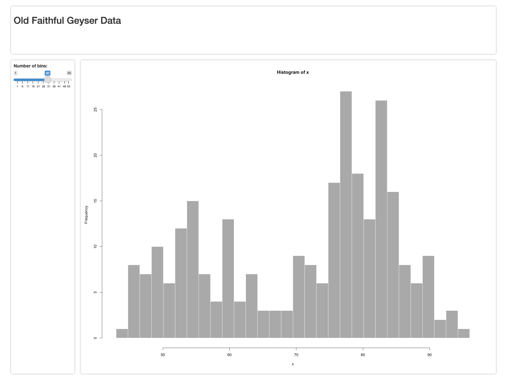

<!-- README.md is generated from README.Rmd. Please edit that file -->

# gridlayout

<!-- badges: start -->
<!-- badges: end -->

A package to making building weblayouts using CSS-Grid easy.

## Installation

You can install the development version from
[GitHub](https://github.com/) with:

``` r
# install.packages("devtools")
devtools::install_github("rstudio/gridlayout")
```

## Setting up your `gridlayout`

The easiest and most common way to specify a grid layout is using a
markdown table syntax. This allows you to use any markdown table editor
of your choice to configure your layout.

``` r
library(gridlayout)

my_layout <- md_to_gridlayout(
  layout_table = "
    |      |120px   |1fr    |1fr    |
    |------|--------|-------|-------|
    |100px |header  |header |header |
    |1fr   |sidebar |plot_a |plot_c |
    |1fr   |sidebar |plot_b |plot_b |"
)

my_layout
#> gridlayout object with 3 rows, 3 columns, and gap size: 1rem 
#>        120px   1fr    1fr   
#> 100px header  header header
#> 1fr   sidebar plot_a plot_c
#> 1fr   sidebar plot_b plot_b
```

You can also use the top left cell of your table to specify the gap
size.

``` r
my_layout <- md_to_gridlayout(
  layout_table = "
    | 25px |120px   |1fr    |1fr    |
    |------|--------|-------|-------|
    |100px |header  |header |header |
    |1fr   |sidebar |plot_a |plot_c |
    |1fr   |sidebar |plot_b |plot_b |"
)

my_layout
#> gridlayout object with 3 rows, 3 columns, and gap size: 25px 
#>        120px   1fr    1fr   
#> 100px header  header header
#> 1fr   sidebar plot_a plot_c
#> 1fr   sidebar plot_b plot_b
```

You can also programatically build your layout using `new_gridlayout`.
Here you simply pass a list of the elements that make up your layout
along with column and row sizes.

``` r
library(gridlayout)

# Assemble list of elements along with their positions
elements_list <- list(
  list(id = "header", start_row = 1, end_row = 1,
       start_col = 1, end_col = 2),
  list(id = "plot",   start_row = 2, end_row = 2,
       start_col = 1, end_col = 1),
  list(id = "table",  start_row = 2, end_row = 2,
       start_col = 2, end_col = 2),
  list(id = "footer", start_row = 3, end_row = 3,
       start_col = 1, end_col = 2)
)

new_gridlayout(
  col_sizes = c("1fr", "2fr"),
  row_sizes = c("100px", "1fr", "1fr"),
  element_list = elements_list
)
#> gridlayout object with 3 rows, 2 columns, and gap size: 1rem 
#>        1fr    2fr   
#> 100px header header
#> 1fr   plot   table 
#> 1fr   footer footer
```

Alternatively, you can use a matrix for a more visually intuitive layout
system (although `my_to_gridlayout()` is even better.)

``` r
elements_mat <- matrix(c(
  "header", "header",
  "plot",   "table",
  "footer", "footer"),
  ncol = 2, byrow = TRUE
)

new_gridlayout(
  col_sizes = c("1fr", "2fr"),
  row_sizes = c("100px", "1fr", "1fr"),
  layout_mat = elements_mat
)
#> gridlayout object with 3 rows, 2 columns, and gap size: 1rem 
#>        1fr    2fr   
#> 100px header header
#> 1fr   plot   table 
#> 1fr   footer footer
```

You can also build a layout from a markdown documents that have your
layout in a code-chunk. This is useful for updating existing
applications layouts without copying and pasting your layout table.

``` r
my_app_loc <- system.file("sample_apps/my_app.Rmd", package = "gridlayout")
my_layout <- rmd_to_gridlayout(my_app_loc)
my_layout
#> gridlayout object with 2 rows, 2 columns, and gap size: 1rem 
#>      1fr     1fr 
#> 1fr sidebar main
#> 1fr sidebar main
```

## Using in a shiny app

Once you’ve setup your layout you can use it in a Shiny app with the
`grid_page()` ui function:

``` r
library(shiny)

my_layout <- "
|      |        |       |
|------|--------|-------|
|2rem  |200px   |1fr    |
|150px |header  |header |
|1fr   |sidebar |plot   |"

# The classic Geyser app with grid layout
shinyApp(
  ui = grid_page(
    layout = my_layout,
    header = h2("Old Faithful Geyser Data"),
    sidebar = sliderInput("bins","Number of bins:", min = 1, max = 50, value = 30),
    plot = plotOutput("distPlot", height = "100%")
  ),
  server = function(input, output) {
    output$distPlot <- renderPlot({
      x    <- faithful[, 2]
      bins <- seq(min(x), max(x), length.out = input$bins + 1)
      hist(x, breaks = bins, col = 'darkgray', border = 'white')
    })
  }
)
```

 *Screenshot
of grided geyser app running*

`grid_page()` will automatically make your gridlayout fill the entire
page. If you are interested in having a finer-grain control over the
size and position of your grid layout you can use the `grid_container()`
function to place your grid layout wherever you want. The equivalent app
to above can be created by replacing the UI definition with a
`fluidPage` containing a `grid_container()`:

``` r
...
shinyApp(
  ui = fluidPage(
    theme = bslib::bs_theme(),
    grid_container(
      id = "main_grid",
      layout = my_layout,
      container_height = "800px",
      elements = list(
        header = h2(id = "header", "This is my header content"),
        sidebar = sliderInput("bins","Number of bins:", min = 1, max = 50, value = 30),
        plot = plotOutput("distPlot", height = "100%")
      )
    )
  ),
  server = ...
)
```

This time, however the grid is constrained to `800px` tall, no-matter
how large or small the window viewing it is.

## Using in RMarkdown

The function `use_gridlayout_rmd()` called in the `setup` chunk of an
RMarkdown file will enable you to use gridlayout to layout your
document. Just match the section headers to the layout element names and
place layout md table in a `gridlayout` chunk…

**`my_app.rmd`**

    ---
    title: "`gridlayout` in Rmarkdown"
    author: "Nick Strayer"
    date: "3/9/2021"
    output: html_document
    ---


    ## Main


    ```gridlayout
    |      |        |         |
    |------|--------|---------|
    |2rem  |200px   |1fr      |
    |150px |header  |header   |
    |1fr   |sidebar |main     |
    |120px |footer  |footer   |
    ```


    ## Sidebar

    Here is some content for the sidebar

    ## Footer

    Anything you want could go in the footer.


*Output of `my_app.rmd`*

## Working with layout object

Once you have your `gridlayout` object, you can convert it to a markdown
table spec or to the CSS that generates the given grid.

``` r
cat(to_md(my_layout))
#> |     |        |     |
#> |-----|--------|-----|
#> |1rem |1fr     |1fr  |
#> |1fr  |sidebar |main |
#> |1fr  |sidebar |main |
```

``` r
cat(to_css(my_layout))
#> body {
#>   display: grid;
#>   grid-template-rows: 1fr 1fr;
#>   grid-template-columns: 1fr 1fr;
#>   grid-gap: 1rem;
#>   padding: 1rem;
#>   height: 100vh;
#> }
#> 
#> body > * {
#>   box-sizing: border-box;
#>   padding: 0.8rem;
#>   overflow: hidden;
#>   box-shadow: 0 0 0.5rem rgb(0 0 0 / 35%);
#>   border-radius: 0.5rem;
#> }
#> 
#> #sidebar {
#>   grid-column-start: 1;
#>   grid-column-end: 2;
#>   grid-row-start: 1;
#>   grid-row-end: 3;
#> }
#> #main {
#>   grid-column-start: 2;
#>   grid-column-end: 3;
#>   grid-row-start: 1;
#>   grid-row-end: 3;
#> }
```

If you want to get at the individual components or “elements” stored in
your grid you can use `get_elements()`.

``` r
head(get_elements(my_layout), 2)
#> [[1]]
#> [[1]]$id
#> [1] "sidebar"
#> 
#> [[1]]$start_row
#> [1] 1
#> 
#> [[1]]$end_row
#> [1] 2
#> 
#> [[1]]$start_col
#> [1] 1
#> 
#> [[1]]$end_col
#> [1] 1
#> 
#> 
#> [[2]]
#> [[2]]$id
#> [1] "main"
#> 
#> [[2]]$start_row
#> [1] 1
#> 
#> [[2]]$end_row
#> [1] 2
#> 
#> [[2]]$start_col
#> [1] 2
#> 
#> [[2]]$end_col
#> [1] 2
```
