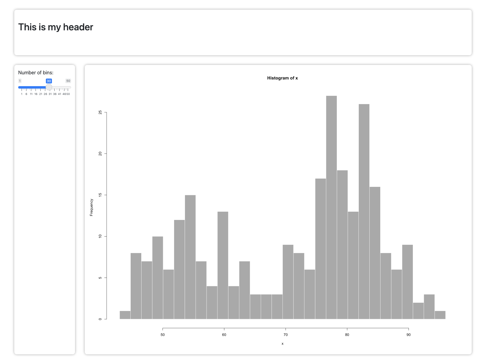
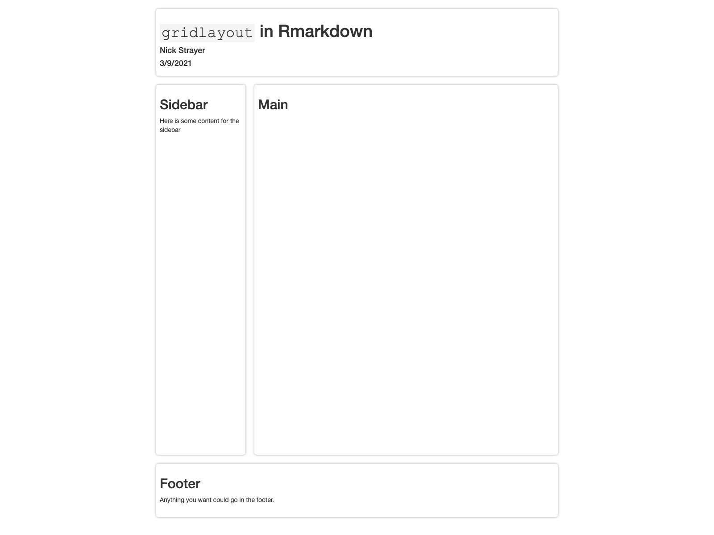

<!-- README.md is generated from README.Rmd. Please edit that file -->

# gridlayout

<!-- badges: start -->

[](https://github.com/rstudio/gridlayout/actions)
<!-- badges: end -->

Build dashboard-style layouts for Shiny and RMarkdown easily using
CSS-Grid.

## Installation

You can install the development version from
[GitHub](https://github.com/) with:

``` r
# install.packages("devtools")
devtools::install_github("rstudio/gridlayout")
```

## Setting up your `gridlayout`

The easiest and most common way to specify a grid layout is using an
character vector syntax where the elements in your layout are visually
lined up making the general gist of the layout clear at a glance.

``` r
library(gridlayout)

my_layout <- new_gridlayout(c(
  "      120px   1fr    1fr   ",
  "100px header  header header",
  "1fr   sidebar plot_a plot_c",
  "1fr   sidebar plot_b plot_b"
))

my_layout
#> gridlayout of 5 elements: 
#>         120px   1fr    1fr   
#>   100px header  header header
#>   1fr   sidebar plot_a plot_c
#>   1fr   sidebar plot_b plot_b
#> Gap of 12px. Total height of viewport.
#> 
#> Alternate layouts:  
#>   
#>   - Width < 500px 
#>            1fr    
#>     85px  header 
#>     350px sidebar
#>     350px plot_a 
#>     350px plot_b 
#>     350px plot_c 
#>   Gap of 12px. Total height of auto.
```

For more info and alternative ways of defining a layout see
`vignette("defining-a-layout", package = "gridlayout")`.

## Using in a shiny app

Once you’ve setup your layout, the easiest way you can use it in your
shiny apps is with the `grid_page()` ui function:

``` r
library(shiny)

# The classic Geyser app with grid layout
shinyApp(
  ui = grid_page(
    layout = c(
      "     200px   1fr   ",
      "85px header  header",
      "1fr  sidebar plot  "
    ),
    grid_card_text("header", "Geysers!", is_title = TRUE),
    grid_card(
      "sidebar",
      title = "Settings",
      sliderInput("bins","Number of bins:", 
                  min = 1, max = 50, value = 30, width = "100%")
    ),
    grid_card(
      "plot",
      plotOutput("distPlot", height="100%")
    )
  ),
  server = function(input, output) {
    output$distPlot <- renderPlot({
      x    <- faithful[, 2]
      bins <- seq(min(x), max(x), length.out = input$bins + 1)
      hist(x, breaks = bins, col = 'darkgray', border = 'white')
    })
  }
)
```

 *Screenshot of
grided geyser app running*

## Other ways of using `gridlayout` in your app

`grid_page()` will automatically make your gridlayout fill the entire
page. If you are interested in having a finer-grain control over the
size and position of your grid layout you can use the `grid_container()`
function to place your grid layout wherever you want. The equivalent app
to above can be created by replacing the UI definition with a
`fluidPage` containing a `grid_container()`:

``` r
...
shinyApp(
  ui = fluidPage(
    grid_container(
      layout = c(
        "     200px   1fr   ",
        "85px header  header",
        "1fr  sidebar plot  "
      ),
      grid_card_text("header", "Geysers!"),
      grid_card(
        "sidebar",
        title = "Settings",
        sliderInput("bins", "Number of bins:", 
                    min = 1, max = 50, value = 30, width = "100%")
      ),
      grid_card(
        "plot",
        plotOutput("distPlot", height="100%")
      )
    )
  ),
  server = ...
)
```

This time, however the grid is constrained to `800px` tall, no-matter
how large or small the window viewing it is.

Alternatively you can use `grid_nested()` to use a `gridlayout` layout
within a panel another `gridlayout`.

``` r
...
shinyApp(
  ui = grid_page(
  layout = c(
    "     250px   1fr   ",
    "50px header  header",
    "1fr  sidebar plots "
  ),
  grid_card_text("header", "This is my header"),
  grid_card(
    "sidebar",
    title = "Settings",
    sliderInput("bins", "Number of bins:", min = 1, max = 50, value = 30, width = "100%")
  ),
  grid_nested(
    "plots",
    title = "Plots - in technicolor",
    layout = c(
      "distPlot distPlot distPlot",
      "redPlot  bluePlot greenPlot"
    ),
    grid_card_plot("distPlot"),
    grid_card_plot("redPlot"),
    grid_card_plot("bluePlot"),
    grid_card_plot("greenPlot")
  ),
  server = ...
)
```

## Using in RMarkdown

The function `use_gridlayout_rmd()` called in the `setup` chunk of an
RMarkdown file will enable you to use gridlayout to layout your
document. Just match the section headers to the layout element names and
place layout md table in a `gridlayout` chunk…

**`my_app.rmd`**

    ---
    title: "`gridlayout` in Rmarkdown"
    author: "Nick Strayer"
    date: "3/9/2021"
    output: html_document
    ---


    ## Main


    ```gridlayout
    |      |        |         |
    |------|--------|---------|
    |2rem  |200px   |1fr      |
    |150px |header  |header   |
    |1fr   |sidebar |main     |
    |120px |footer  |footer   |
    ```


    ## Sidebar

    Here is some content for the sidebar

    ## Footer

    Anything you want could go in the footer.



*Output of `my_app.rmd`*
