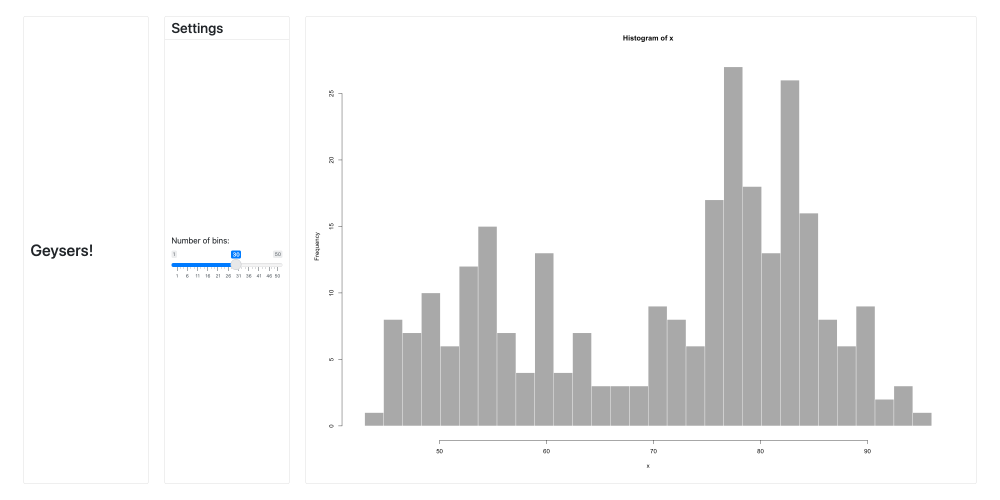
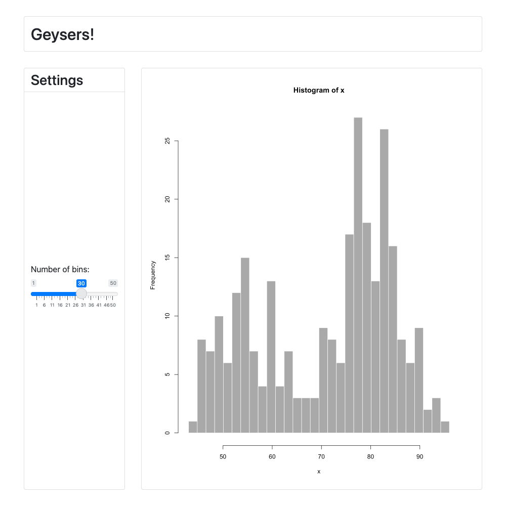
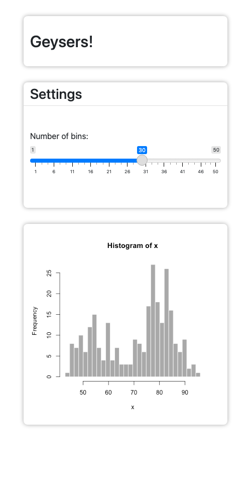
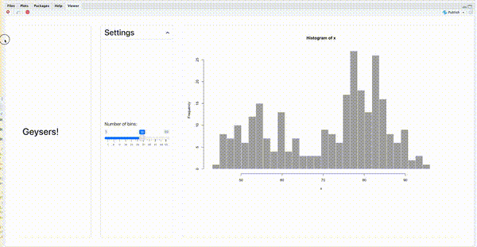

```{r, include = FALSE}
knitr::opts_chunk$set(
  collapse = TRUE,
  echo = FALSE,
  out.width = "100%"
)

screen_sizes <- list(
  list(width = 2000, height = 1000),
  list(width = 1000, height = 1000),
  list(width = 500, height = 1000)
)

```

```{r, eval = FALSE}
# Run this code manually to build screenshots
for (sizes in screen_sizes) {
  width <- sizes$width
  height <- sizes$height
  webshot2::appshot(
    here::here("inst/demo_apps/alternate_layouts/app.R"),
    file = here::here(glue::glue("vignettes/alternate-layouts_w{width}_h{height}.png")),
    cliprect = "viewport",
    delay = 1.5,
    vwidth = width,
    vheight = height
  )
}
```


```{r setup}
library(gridlayout)
```

Your app is likely to be viewed in different scenarios on different devices. This means it's important to make sure it looks good in all of those scenarios. A nice grid layout with lots of side-by-side panels won't work too well if your viewer is looking at it on a small phone screen. 

To account for these situations `gridlayout` allows you to specify "alternate" layouts for your app. These are distinct layout's that determine how your app looks on different screen sizes. Most of the time this is going to be used for making a layout for the afformentioned phone scenario, but they can be defined for any page width range. 

## Example
Here we define a basic layout for an app with a header on top, a sidebar on the side, and a plot. We also define a layout for mobile that is a stack of all of those things, placing what was the "sidebar" now just below the header. There's also a super-wide-screen layout. Perhaps for an ultrawide monitor that places all the items side by side. 

```{r, echo = TRUE}
main_layout <- "
|      |        |       |
|------|--------|-------|
|2rem  |200px   |1fr    |
|100px |header  |header |
|1fr   |sidebar |plot   |"

mobile_layout <- "
|----- |--------|
|2rem  |1fr     |
|100px |header  |
|250px |sidebar |
|400px |plot    |"

big_screen_layout <- "
|-----|-------|--------|-----|
|2rem |250px  | 250px  |1fr  |
|1fr  |header |sidebar |plot |
"

new_gridlayout(
  main_layout,
  alternate_layouts = list(
    list(
      layout = mobile_layout,
      width_bounds = c(max = 600)
    ),
    list(
      layout = big_screen_layout,
      width_bounds = c(min = 1600)
    )
  )
)
```

## Syntax

The alternate layouts are provided via the `alternate_layouts` argument in `new_gridlayout()`. This takes the form of a list of layouts containing:

- A `layout` table (or existing `gridlayout` object)
- `width_bounds` that the layout should occur for. For instance, out `mobile_layout` is active when the viewing device's screen is narrower than `600` pixels and our `big_screen_layout` is active when the screen is larger than `1600` pixels. You can also set upper and lower bounds in case you wanted to have intermediate layouts (perhaps a tablet layout for between `600` and `1000` pixels in width.)
- An optional `container_height`. Typically `gridlayout` is smart enough to figure this one out for you, however. 

## Output

The following are screenshots of the exact same app at different screen sizes using the layouts above. 


###  Screen width = 2000px

```{r}

```


### Screen width = 1000px

```{r}

```


### Screen width = 500px

```{r, out.width = "500px"}

```

## In-action




# Default mobile layout

If no alternate layouts are specified, a mobile layout is automatically generated by simply stacking all the panels in your app at `300px` in height. 

```{r}
main_layout <- "
|      |        |       |
|------|--------|-------|
|2rem  |200px   |1fr    |
|100px |header  |header |
|1fr   |sidebar |plot   |"

new_gridlayout(main_layout)
```

If you don't want this (say you're targeting mobile by default already) you can set `alternate_layouts` to `NULL`. 

```{r}
new_gridlayout(main_layout, alternate_layouts = NULL)
```

