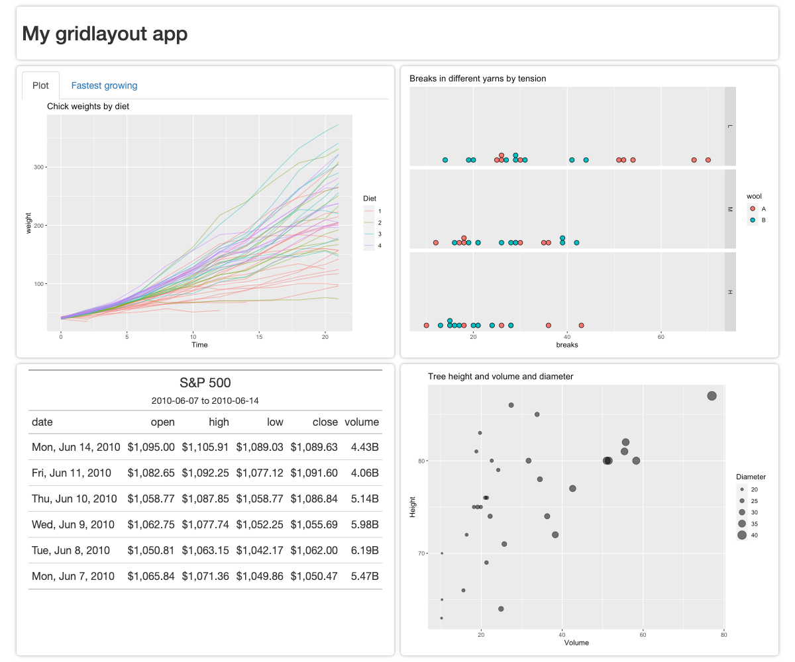

```{r, include = FALSE}
knitr::opts_chunk$set(
  collapse = TRUE,
  comment = "#>",
  out.width = "100%"
)
```


```{r, eval = FALSE, echo=FALSE}
# Run this code manually to build screenshots
library(here)
library(glue)
source(here::here("tests/screenshot-tests/setupScreenshots.R"))

layouts <- c(
  "stack",
  "scrolling_stack",
  "four_panel",
  "focal_chart_top",
  "focal_chart_side"
)

for (layout_type in layouts) {
  withr::with_options(
    list("layout-mode" = layout_type),
    webshot2::appshot(
      shiny::shinyAppFile(
        here("inst/demo_apps/layout_examples/app.R")
      ),
      file = here(glue("vignettes/layouts_demo_{layout_type}.png")),
      cliprect = "viewport",
      delay = 1,
      vwidth = 1200,
      vheight = 1000
    )
  )
}

```

```{r setup}
library(gridlayout)
```


## Basic stack
```{r, eval = FALSE}
new_gridlayout("
  |      |         |
  |------|---------|
  |1rem  |1fr      |
  |80px  |header   |
  |1fr   |chickens |
  |1fr   |treePlot |
  |1fr   |yarnPlot |")
```

```{r, echo = FALSE, message=FALSE}

```


## Scrolling stack
```{r, eval = FALSE}
new_gridlayout("
  |      |           |
  |------|-----------|
  |1rem  |1fr        |
  |80px  |header     |
  |400px |chickPlot  |
  |400px |chickTable |
  |400px |treePlot   |
  |400px |yarnPlot   |",
  container_height = "auto")
```

```{r, echo = FALSE, message=FALSE}
knitr::include_graphics("layouts_demo_scrolling_stack.png")
```


## 2x2 equal grid 
```{r, eval = FALSE}
new_gridlayout("
  |     |           |         |
  |-----|-----------|---------|
  |1rem |1fr        |1fr      |
  |80px |header     |header   |
  |1fr  |chickPlot  |yarnPlot |
  |1fr  |chickTable |treePlot |
  ")
```

```{r, echo = FALSE, message=FALSE}

```


## Focal chart -- top
```{r, eval = FALSE}
new_gridlayout("
  |     |          |         |
  |-----|----------|---------|
  |1rem |1fr       |1fr      |
  |80px |header    |header   |
  |2fr  |chickens  |chickens |
  |1fr  |treePlot  |yarnPlot |
  ")
```

```{r, echo = FALSE, message=FALSE}

```


## Focal chart -- side
```{r, eval = FALSE}
new_gridlayout("
  |     |         |         |
  |-----|---------|---------|
  |1rem |2fr      |1fr      |
  |80px |header   |header   |
  |1fr  |chickens |treePlot |
  |1fr  |chickens |yarnPlot |
  ")
```

```{r, echo = FALSE, message=FALSE}

```


