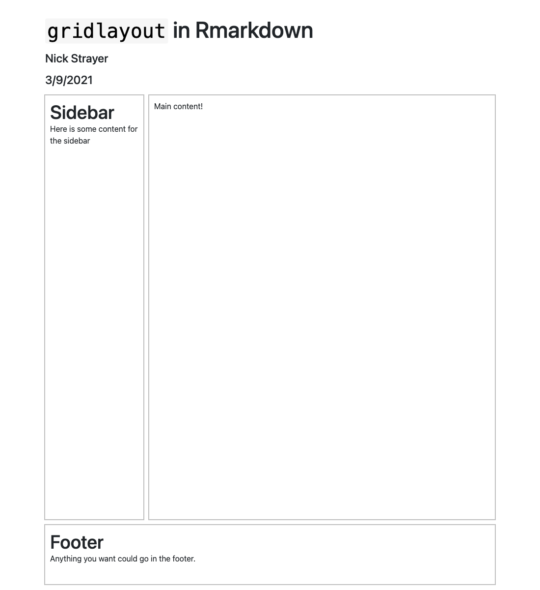

```{r, include = FALSE}
knitr::opts_chunk$set(
  collapse = TRUE,
  comment = "",
  out.width = "100%",
  eval = FALSE
)

rmd_loc <- "demo_apps/rmarkdown_demo/grid_markdown.Rmd"
```

```{r, eval = FALSE, echo = FALSE}
# Generate screenshots for this vignette
source(here::here("inst/demo_apps/setupScreenshots.R"))


screenshot_demo_app(
  app_path = here::here('inst/demo_apps/', rmd_loc),
  screenshot_name = "use_gridlayout_rmd.png",
  screenshot_root = "vignettes",
  vwidth = 1100
)

```


```{r}
library(gridlayout)
```


By placing the function `use_gridlayout_rmd` in the `setup` chunk of an Rmd you can define a gridlayout table using the a code chunk with the "language" set to `gridlayout`. Any markdown style table (see `md_to_gridlayout()`) will be used to setup a grid-layout for your page. Just make sure your sections are given headers corresponding to the respective grid elements (either using their name or by using the `#My header text {#custom_id}` syntax after the header.)


The following shows how you can customize the appearance of the elements of your layout using "card styles" and custom css. 


# The markdown code

The screenshot below is based on the following `.Rmd`.


```{r, echo=FALSE, eval=TRUE}
rmd_content <- readLines(
  system.file(rmd_loc, package = "gridlayout")
)

cat(paste(rmd_content, collapse = "\n"))
```


## Result


```{r, echo = FALSE, message=FALSE, eval=TRUE}

```


